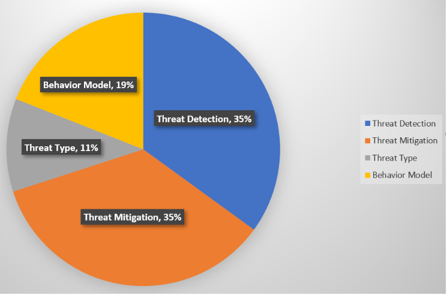
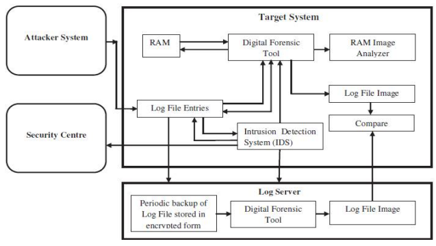

\subsection{Insider Threats}

Security threats can come from inside or outside of an organization. The attacks from insiders, be they from employees, suppliers, or other companies legitimately connected to a company’s computer system, pose a more pernicious threat than external attacks. These insiders have knowledge of the internal workings of the organization, and full possession of all the rights and privileges required to mount an attack that outsiders lack. Consequently, insiders can make their attacks look like normal operations \cite{gheyas2016detection}.

<!-- Các mối đe dọa bảo mật có thể đến từ bên trong hoặc bên ngoài tổ chức. Các cuộc tấn công từ nội bộ, có thể là từ nhân viên, nhà cung cấp hoặc các công ty khác được kết nối hợp pháp với hệ thống máy tính của công ty, gây ra mối đe dọa nguy hiểm hơn các cuộc tấn công từ bên ngoài. Những người trong nội bộ này có kiến ​​thức về hoạt động nội bộ của tổ chức và có đầy đủ sở hữu tất cả các quyền và đặc quyền cần thiết để tiến hành một cuộc tấn công mà người ngoài không có. Do đó, những người trong nội bộ có thể khiến các cuộc tấn công của họ trông giống như các hoạt động bình thường \cite{gheyas2016detection}. -->

To solve this problem, the goal is to classify knowledge organizations within the scope of threat research. By applying machine learning algorithms and analyzing large-scale studies on detecting internal threats, the development involves classifying current internal personnel into different categories, levels of access rights, and the motivations behind them.

<!-- Để giải quyết vấn đề này, mục tiêu là phân loại các tổ chức tri thức trong phạm vi nghiên cứu mối đe dọa. Bằng cách áp dụng các thuật toán học máy và phân tích các nghiên cứu quy mô lớn về phát hiện các mối đe dọa nội bộ, quá trình phát triển bao gồm việc phân loại nhân sự nội bộ hiện tại thành các danh mục, cấp độ quyền truy cập khác nhau và động cơ đằng sau chúng. -->

\subsubsection{Classification results}

<!-- \subsubsection{Kết quả phân loại} -->

According to research \cite{singh2022systematic}, by passing keywords to the search engine. The Boolean AND and OR were used to conduct the search. The search terms were: Insider Threats, Insider Threat Detection, Computer Threats, Security. The platforms searched were: IEEE Xplore Digital Library, ScienceDirect, SpringerLink, ACM Digital Library, Google Scholar. With the following criteria:

<!-- Inclusion Criteria  -->

The paper should focus on the insider threats and its types.

The paper should highlight the insider detection techniques.

The paper should focus on insider threats challenges and its prevention.

<!-- Exclusion criteria -->

The papers should not be about types of threats, it should focus only on insider threats to the cyber world.

Papers published after 2020.

The paper should focus on insider threats challenges and its prevention.

<!-- Summary of results received \cite{singh2022systematic}: -->

All the papers has basic information about threat types and its detection.

It is clear from Fig xxxxxxxxxx, that majority of studies were focused on threat detection and threat mitigation in insider threats.

Fig xxxxxxxxxx, shows the graphical representation of subdivided categories and their applications in insider threats.

The themes found in primary studies shows
that threat detection and threat mitigation are the most popular security application in insider threats, with both comprising of 35 percent each respectively.

The third most popular among the primary studies was, modeling human behaviors to detect the insider threat attack (behavior model). It comprises of 19 Percent of the total studies.

At the last comes the types of threat, which makes up 11 Percent of the total studies.

\subsubsection{Detection and Protection System}

<!-- \subsubsection{Hệ thống phát hiện và bảo vệ} -->

To detect the intrusion, an Intrusion Detection System (IDS) is used. To detect the intrusion and respond in timely manner is its prime function.

<!-- Để phát hiện sự xâm nhập, Hệ thống phát hiện xâm nhập (IDS) được sử dụng. Chức năng chính của nó là phát hiện sự xâm nhập và phản hồi kịp thời. -->

<!-- - **Benefits of Digital Forensic Technique**: This technique helps maintain the integrity and reliability of evidence for later examination. Captured images can be used as evidence in court. -->
<!-- - **Lợi ích của Kỹ thuật Pháp y Kỹ thuật số**: Kỹ thuật này giúp duy trì tính toàn vẹn và độ tin cậy của bằng chứng cho việc kiểm tra sau này. Những hình ảnh được chụp có thể được sử dụng làm bằng chứng trước tòa. -->

