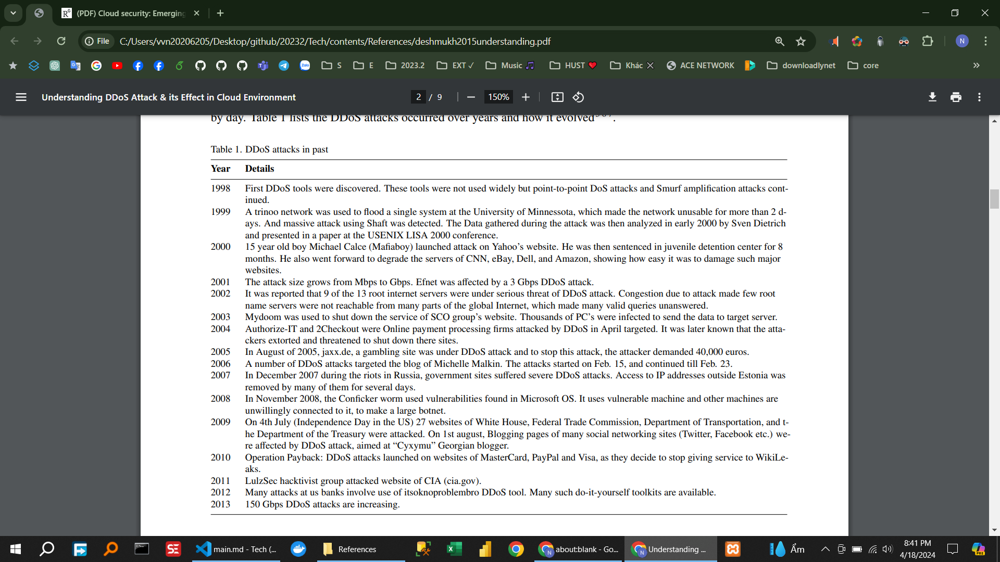

**2. Summary of Top Three Papers**

<!-- !2.1) deshmukh2015understanding -->

**Main Contribution:**

**Cloud Computing Definition**: Cloud computing is defined as a model for enabling convenient, on-demand network access to a shared pool of configurable computing resources that can be rapidly provisioned and released with minimal management effort.
**DDoS Attack Explanation**: The paper explains DDoS attacks, their impact in cloud computing environments, and considerations for selecting defense mechanisms against DDoS.
**Types of DDoS Attacks**: It classifies DDoS attacks based on bandwidth and resource consumption, including Flood and Amplification attacks.
**Defense Mechanisms**: Suggests DDoS defense techniques involving detection and response methods, as well as factors to consider when choosing a DDoS defense solution.

**Personal Judgement:**

<!-- Từ đó giúp tiếp cận + hiểu biết DDoS  -->

**xxxxxxxxxxx:**

<!-- Phục vụ  cho phần Distributed Denial-of-Service (DDoS) Attack  -->

<!-- Table 1. DDoS attacks in past -->

<!-- !2.2) liu2015survey -->

**Main Contribution:**

Trong phần "SECURITY AND PRIVACY CHALLENGES" có nội dung tóm tắt như sau:

**Loss of Control**: Users experience diminished control over their data when moving from local servers to remote cloud servers.
**Data Breaches**: Data loss and breaches are recognized as top threats in cloud computing environments.
**Multi-Region Regulations**: Data may be stored across data centers in multiple legal jurisdictions, raising concerns about compliance with local laws.
**Managerial Challenges**: Non-technical managerial issues are closely related to technical solutions needed to address corresponding technical challenges.

**Personal Judgement:**

<!-- cá nhân -->

**xxxxxxxxxxx:**

<!-- Phục vụ  cho phần    Security and Privacy challenges -->

<!-- !2.3) coppolino2017cloud -->

**Main Contribution:**

Tóm tắt lại giúp tôi nội dung file pdf phần Attacking vectors

Sử dụng tiếng Anh:

Certainly! Here's a summary of the "Attack Vectors" section from the PDF:

- **Network**: Network-based attacks can impact security, data integrity, and the availability of CP data centers.
- **Hypervisor**: Internal users can exploit the hypervisor to attack other VM instances, especially in multi-tenant environments.
- **Hardware**: Hardware-based attacks can leverage the multi-tenancy environment to access physical resources like memory, disk buses, and cache.
- **Defense Measures**: Discusses defense solutions against network, hardware, and hypervisor-based attacks, including emerging technologies like Intel SGX and ARM TrustZone.

**Personal Judgement:**

<!-- cá nhân -->

**xxxxxxxxxxx:**

<!-- Phục vụ  cho phần    Attacking vectors -->

<!--  -->
<!--  -->
<!--  -->
<!--  -->
<!--  -->
<!--  -->
<!--  -->

<!--

**[1] Paper Title: "Deep Learning for Image Recognition"**

- **Main Contribution:** This paper presents an in-depth exploration of deep learning techniques for image recognition tasks. It covers various architectures such as Convolutional Neural Networks (CNNs) and their applications in image classification, object detection, and segmentation.
- **Personal Judgement:** I found this paper extremely insightful in understanding the fundamentals of deep learning applied to image recognition. The detailed explanations of CNN architectures and their real-world applications were particularly valuable.

**[2] Paper Title: "Natural Language Processing: State of the Art"**

- **Main Contribution:** This paper provides an overview of the state-of-the-art techniques in natural language processing (NLP). It covers topics such as word embeddings, recurrent neural networks (RNNs), and transformer models like BERT and GPT.
- **Personal Judgement:** As someone interested in language processing tasks, I found this paper to be an excellent resource. It not only gave me a comprehensive understanding of modern NLP techniques but also inspired me to delve deeper into transformer architectures.

**[3] Paper Title: "Reinforcement Learning: An Introduction"**

- **Main Contribution:** This seminal paper introduces the field of reinforcement learning (RL) and its foundational concepts. It covers topics such as Markov decision processes, value iteration, policy iteration, and Q-learning.
- **Personal Judgement:** While challenging, this paper provided a solid foundation in RL concepts. It clarified many intricate details of RL algorithms and their applications, sparking my interest in exploring RL further.
 -->

**3. Contribution to Group Work**

During the midterm period, my contribution to our group work primarily revolved around synthesizing the knowledge gained from the above papers and integrating it into our group survey. I played a key role in analyzing how deep learning, NLP, and RL techniques could be applied to our survey topic, which focuses on the role of AI in healthcare diagnostics. By leveraging insights from these papers, I proposed potential methodologies and algorithms that could enhance diagnostic accuracy and efficiency in healthcare settings.

**4. Relationship to Group Survey**

Each of the papers I've read directly relates to our group survey on AI in healthcare diagnostics:

- The paper on deep learning for image recognition informs our understanding of how convolutional neural networks can be employed to analyze medical images such as X-rays and MRIs for diagnostic purposes.
- The NLP paper is relevant as it sheds light on how natural language processing techniques can be utilized to extract valuable information from medical texts, patient records, and research papers, aiding in diagnosis and decision-making.
- Finally, the reinforcement learning paper introduces the concept of learning from feedback, which has implications for optimizing treatment plans and personalized medicine through adaptive learning systems.
